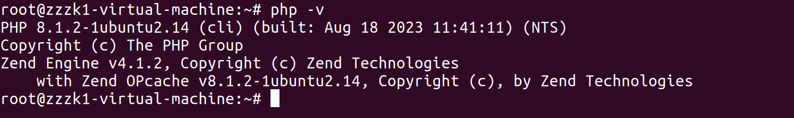
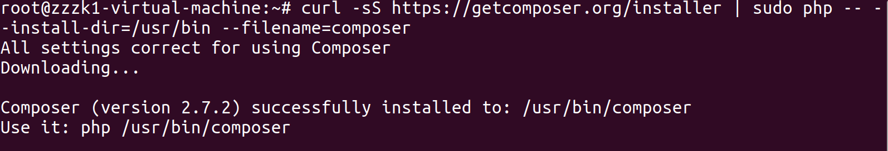
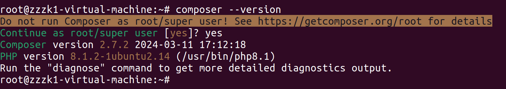
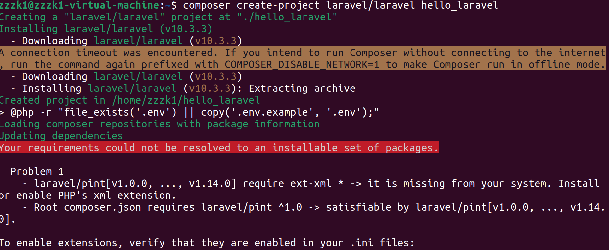
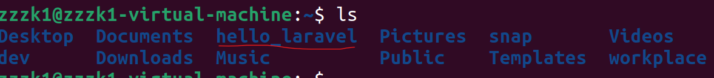
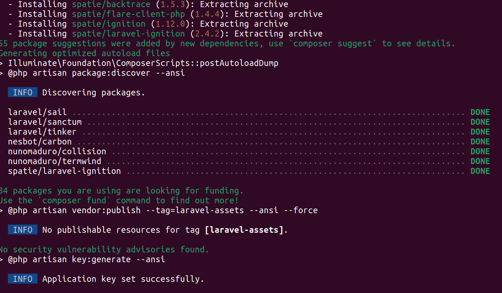
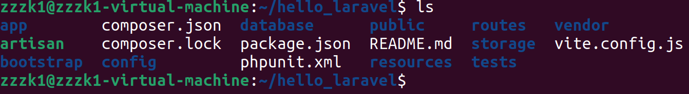
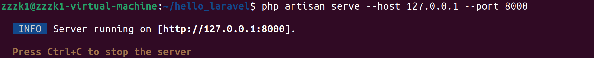
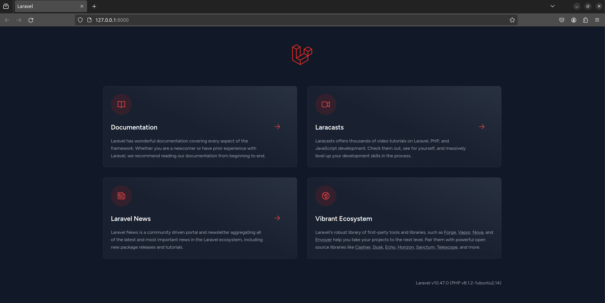

## Task

- ✅(03/13) 写一篇文档给室友介绍如何安装 PHP/Laravel 本地开发环境
- ✅(03/13) 在自己的电脑上运行一个空白的 Laravel 项目

- ⭕ 用 Laravel 实现一个记事本，并推送到自己的 Github 仓库中

- ✅(03/15) a. 记录包含标题和内容 
- ✅(03/16) b. 可以给单条记录添加 tag (使用 Laravel 提供的 Relation 功能实现)
- ⭕ c. 可以恢复被删除的记录 (使用软删除)
- ⭕ d. 支持复制单条记录，被复制的记录标题需要按照以下规则修改：
     - 如果被复制的记录标题是 "Title", 如果数据库中不存在标题为 "Title(1)" 的记录，复制后的记录标题是 "Title(1)"
     - 如果被复制的记录标题是 "Title", 但是数据库中已经存在标题为 "Title(1)" 的记录，复制后的记录标题是 "Title(2)"
     - 如果被复制的记录标题是 "Title(1)", 复制后的记录标题是 "Title(2)"
       ...
     - 如果被复制的记录标题是 "Title(99)", 复制后的记录标题是 "Title(99)(1)" 
     - 如果被复制的记录标题是 "Title(99)(99)", 复制后的记录标题是 "Title(99)(99)(1)" , 以此类推
- ⭕ 单元测试 & 集成测试
- ⭕ GitHub action CI

## API Desgin  

#### 根据 笔记的 id 获取详情

```http
Get Method:	/notepad/{noteId}
```

1. 借助 Note Model，通过 note id 实例化 note 记录
2. 通过 Note Model 的多对多关联关系(Note <---> Tag)，返回 此 note id 对应实例的 tags
3. 构建并返回视图：NotePad Page: View(Note, Tags)

#### 根据 笔记的 id 对记事本详情页面进行修改

```http
Post Method: /notepad/{noteId}
```

1. 参数检验：title、content 不能为空
2. 对于 tag，允许删除所有的 tag
3. 更新 notes 表、同时更新 notes_tags 关联关系表
4. 返回执行更新操作的结果

#### 新增一篇笔记

```http
Post Method: /notepad/create
```

1. 参数检验：title 是否重名、title 是否为空
2. 通过 Note Model 完成持久化

#### 删除一篇笔记

```http
DELETE Method: /notepad/{noteId}
```

1. 通过 Note Model 执行软删除
2. 返回执行删除操作的结果

#### 恢复删除的笔记

```http
Get Method:	/notepad/restore/{noteId}
```

1. 根据 note id 恢复软删除的记录

#### 复制一条笔记

```http
Get Method: /notepad/copy/
```

todo...

## 环境配置

### Ubuntu 22.04 上配置 PHP 框架 Laravel 

#### 1. 更新系统包，保证所有的系统包都是最新的

```shell
sudo apt update
sudo apt upgrade
```
---
#### 2. 安装 PHP 以及扩展包并验证

仅仅添加当前项目会用的扩展包，有需求的时候再加

- [php-common](https://stackoverflow.com/questions/23295393/what-is-php-common-and-what-does-it-do)：PHP 通用文件包，包含了绝大多数的基础功能和配置
- php-mysqlnd：用于与 MySQL 进行连接交互
- php-curl：PHP 的 cURL 扩展，这里用来发送测试的 HTTP 请求

```shell
//这是第一条命令, 用于安装
sudo apt install php php-common php-cli php-mysqlnd php-curl

//这是第二条命令, 用于检查安装结果
php -v
```

成功的截图如下：



---

#### 3. 安装 PHP Composer

安装 Laravel 依赖项需要 [Composer](https://getcomposer.org/doc/00-intro.md)(Java开发中相当于 Maven)

```sh
//这是第一条命令, 用于安装
curl -sS https://getcomposer.org/installer | 
sudo php -- --install-dir=/usr/bin --filename=composer

//这是第二条命令, 用于检查安装结果
composer --version
```

安装完成：



测试一下：



---

#### 4. 创建一个 Composer 项目

> hello_laravel 是项目名

```shell
composer create-project laravel/laravel hello_laravel
```

> **[php xml 这个扩展在 Ubuntu 中默认没有启用](https://stackoverflow.com/questions/68873115/require-ext-xml-it-is-missing-from-your-system-install-or-enable-phps-xml)**
>
> 

```sh

apt-get install php-xml

// 再试一次
composer create-project laravel/laravel hello_laravel
```

> 再次创建项目的时候记得删掉上面创建失败的
>
> 



#### 5.启动框架

##### 5.1 命令行进入项目内

```sh
cd hello_laravel
ls
```



##### 5.2 启动服务器 并暴露端口

```
php artisan serve --host 127.0.0.1 --port 8000
```



##### 5.3 使用Web浏览器访问



